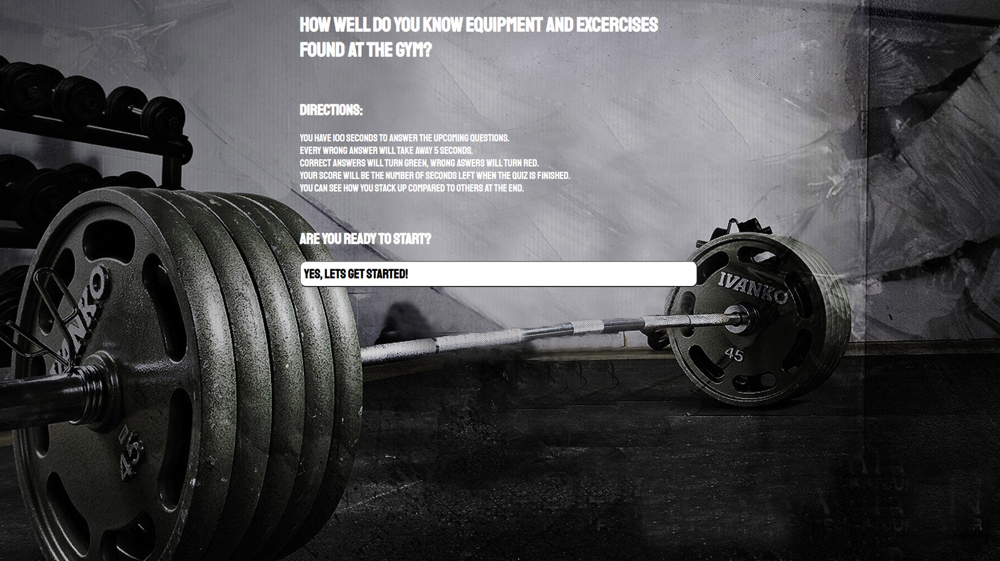

# Gym Quiz

## Description
Want to test your knowledge about the gym? You've come to the right place.\
This quiz provides a timer, multiple questions and answers, and a local storage for high scores.\
Most of the code is provided through the use of javascript by dynamically creating elements within the HTML file.

## Links
* Depoloyed application: https://tsinmoua.github.io/Gym_Quiz/
* Repository: https://github.com/tsinmoua/Gym_Quiz

## Usage Instructions
Read the directions provided at the start page. Click the buttons to continue on with the quiz. At the end you will be able to put your name down to see how you compare with others who took the quiz.

## Installion Instructions
N/A

## Credits/Thanks
Followed a tutorial https://www.youtube.com/watch?v=riDzcEQbX6k&t=1421s&ab_channel=WebDevSimplified

Thanks to my tutor session with Aylan Mello who helped me brainstorm ideas when I was coming to a dead end.

## License Information
N/A